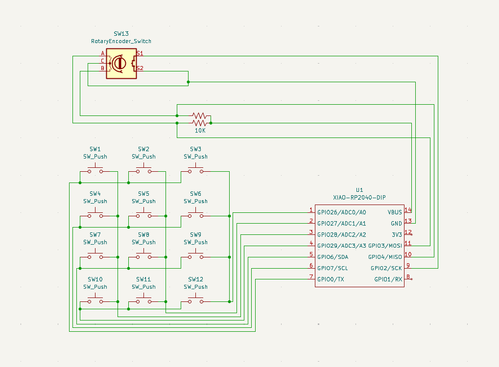
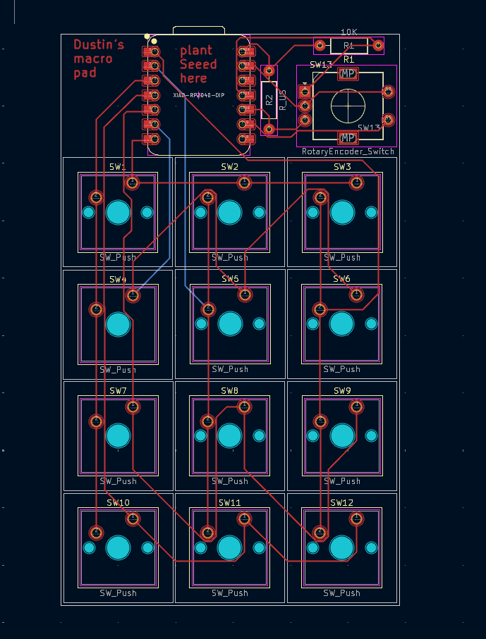
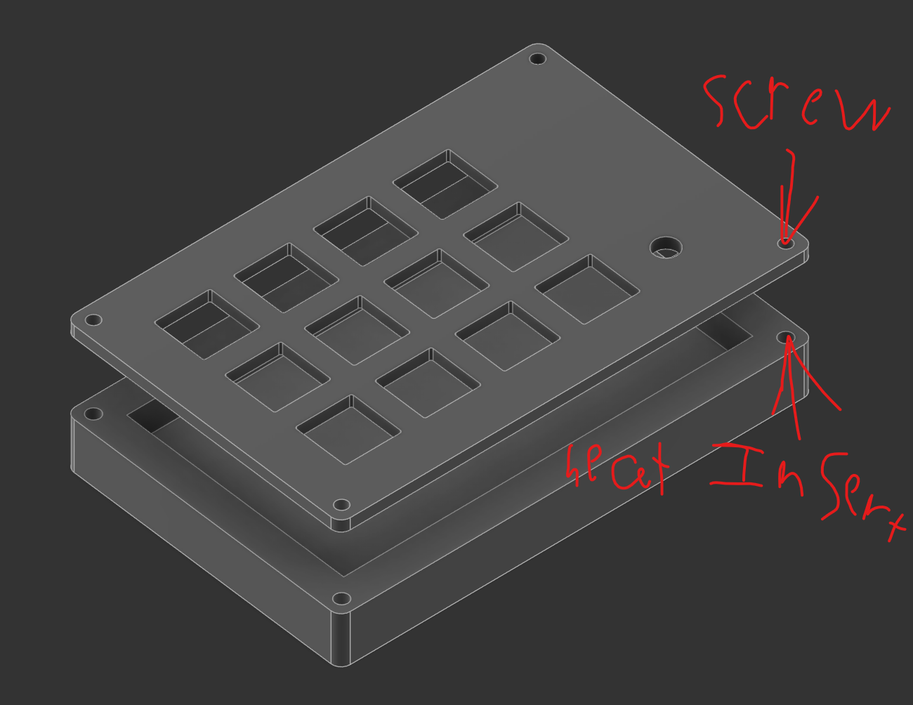

<!DOCTYPE html>
<html lang="en">
<head>
<meta charset="UTF-8">
<meta name="viewport" content="width=device-width, initial-scale=1.0">
<title>Full Hackpad README</title>

</head>
<body>

<h1>Full Hackpad – 12 Key Macro Pad with Encoder</h1>

<h2>All Images</h2>
<table>
<tr>
    <th>Image</th>
    <th>Description</th>
</tr>
<tr>
    <td></td>
    <td>Full Hackpad CAD model</td>
</tr>
<tr>
    <td></td>
    <td>Board schematic</td>
</tr>
<tr>
    <td></td>
    <td>PCB layout</td>
</tr>
<tr>
    <td></td>
    <td>Fitment / assembly test</td>
</tr>
</table>

<h2>💻 Firmware Overview</h2>

The code is designed to be a <strong>largley configurable macropad</strong>. Each key can be assigned shortcuts, macros, or other functions.

<ul>
    <li>Rotary encoder os <strong>volume control</strong>.</li>
</ul>

<h2>Bill of Materials (BOM)</h2>
<table>
<tr>
    <th>Component</th>
    <th>Quantity</th>
    <th>Notes</th>
</tr>
<tr><td>10K Resistor</td><td>2</td><td>i will Provid</td></tr>
<tr><td>Rotary Encoder w/ Push Button</td><td>1</td><td>If the one you ship dose not have a Switch, i will Provid it</td></tr>
<tr><td>Cherry MX Switches</td><td>12</td><td></td></tr>
<tr><td>DSA Keycaps</td><td>12</td><td></td></tr>
<tr><td>M3x5x4 Heat-set Inserts</td><td>4</td><td></td></tr>
<tr><td>M3x12mm SHCS Bolts</td><td>4</td><td></td></tr>
<tr><td>Seeed XIAO RP2040</td><td>1</td><td></td></tr>
<tr><td>PCB</td><td>1</td><td></td></tr>
<tr><td>3D Printed Case (2 parts)</td><td>1 Set</td><td>Top + bottom shell</td></tr>
</table>

<h2>Assembly Steps</h2>
<ol>
    <li>Install <strong>heat-set brass inserts</strong>.</li>
    <li>Solder switches, encoder, and other components.</li>
    <li>Attach <strong>XIAO RP2040</strong> to PCB.</li>
    <li>Flash firmware.</li>
    <li>Assemble the case using screws.</li>
    <li>Install keycaps./li>
</ol>

</body>
</html>
